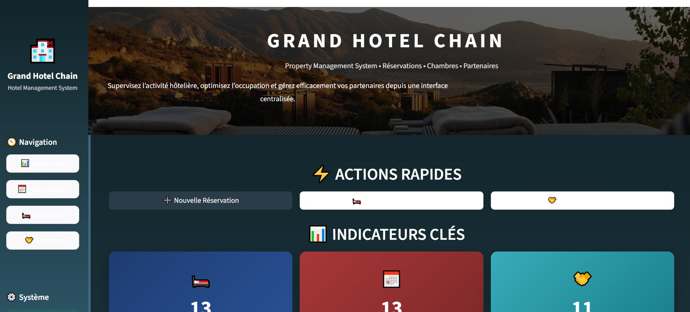
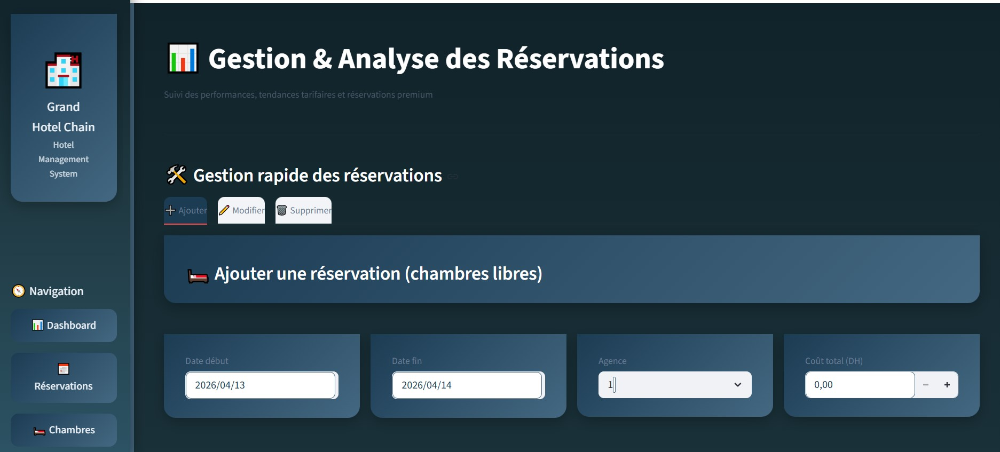
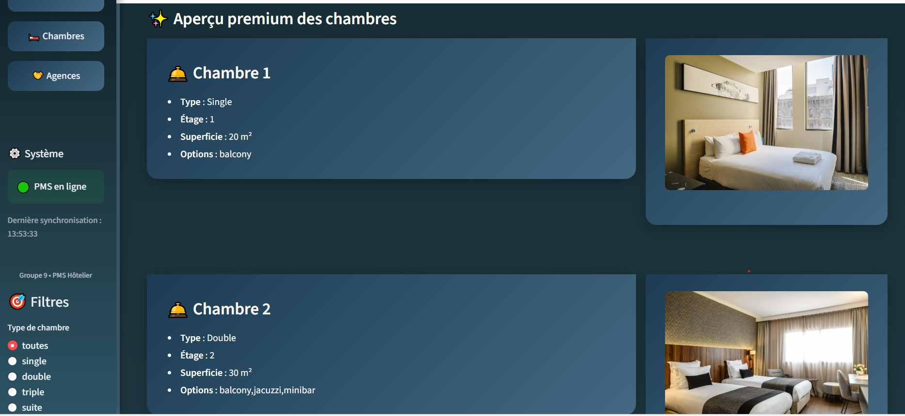
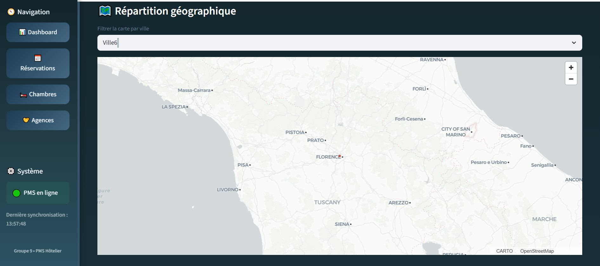

# 🏨 Hotel Reservation Management System

> Academic group project – a complete hotel reservation platform with Docker, MySQL, and Streamlit.


---

## 📸 Preview









---

## 📋 About

This project was developed as part of an **academic group project** in computer engineering at **ENSA ,UIT-Kénitra**. It demonstrates the integration of a **relational database (MySQL)** with an interactive web frontend (**Streamlit**) using **Docker** for containerized deployment.

The application manages hotel rooms (standard and suites), travel agencies, reservations, and provides analytical reports (monthly cost trends, most expensive room per month, turnover by agency). The entire database is initialized and run inside a **Docker container**, ensuring reproducibility and ease of deployment.

---

## ✨ Features

| Category | Details |
|---|---|
| 🏢 **Agency management** | List, map, filter by city, view full address & contact |
| 🛏️ **Room & suite catalog** | Filter by type, floor, surface, equipment, availability |
| 📅 **Reservation system** | Create/view bookings with price and date ranges |
| 📊 **Analytical dashboards** | Monthly average daily cost (line chart), highest cost room per month, turnover by room & agency |
| 🗺️ **Geolocation** | Display agencies on an interactive map |
| 📥 **CSV export** | Download filtered room data |
| 🐳 **Full Docker support** | MySQL + phpMyAdmin in containers |

---

## 🛠️ Built With

| Technology | Usage |
|---|---|
| Python 3.9+ | Backend logic and data processing |
| Streamlit | Interactive web UI |
| MySQL 8.0 | Relational database |
| Docker & Compose | Containerized database + phpMyAdmin |
| Altair / Matplotlib | Data visualizations |
| Pandas | Data manipulation and SQL queries |
| CSS3 | Custom theming |

---

## 📁 Project Structure

```
hotel-reservation-project1/
├── .env                          # Environment variables (DB credentials)
├── docker-compose.yml            # Launches MySQL, phpMyAdmin, Streamlit
├── README.md                     # Project documentation
├── mysql-docker/                 # MySQL initialization scripts
│   └── data/
│       └── mysqlsampledatabase.sql   # Database dump (hotel tables + sample data)
├── screenshots/                  # Screenshots added to README
└── streamlit-app/                # Main Streamlit application
    ├── Dockerfile                # Docker build instructions
    ├── app.py                    # Main entry point
    ├── db.py                     # Database connection & queries
    ├── utils.py                  # Helper functions
    ├── requirements.txt          # Python dependencies
    ├── assets/                   # Static images (room types, background)
    ├── pages/                    # Multi‑page app pages
    └── styles/                   # CSS stylesheets
```

---

## 🗄️ Database Schema

| Table | Description |
|---|---|
| VILLE | City information |
| AGENCE | Travel agencies |
| CHAMBRE | Rooms |
| SUITE | Suites |
| HAS_EQUIPEMENT | Room equipment |
| HAS_ESPACES_DISPO | Suite spaces |
| RESERVATION | Bookings |

---

## 🚀 Run Locally (with Docker)

### Prerequisites

- Docker & Docker Compose
- Python 3.9+
- Git

### Installation

```bash
git clone https://github.com/fatimaez-zahrae11/hotel-reservation-project1.git
cd hotel-reservation-project1

docker-compose up -d

pip install streamlit pandas mysql-connector-python altair matplotlib

streamlit run app.py
```

Then open:
👉 http://localhost:8501
👉 phpMyAdmin: http://localhost:8081

---

## ⚙️ Configuration

Edit database connection in `db.py`:

```python
DB_HOST = "127.0.0.1"
DB_PORT = 3307
DB_USER = "adam"
DB_PASSWORD = "1234"
DB_NAME = "hotel_db"
```

---

## 🐛 Troubleshooting

- Streamlit not found → install or activate environment
- MySQL connection error → check credentials
- Docker issue → run `docker ps`
- No data → re-import SQL file

---

## 📖 Usage

| Page | Description |
|---|---|
| TestConnexion | Test database connection |
| Agences | View agencies + map |
| Chambres | Filter and analyze rooms |
| Réservations | Manage bookings + analytics |

---

## 👥 Authors

- **Fatima Ezzahrae** – Computer Engineering Student (ENSA Kénitra)
in collaboraton with the project team 

---

## 🎓 Academic Context

This project was developed at **ENSA, Kénitra** as part of a database and web development course.

---

## 📄 License

**This project is for educational purposes only.**
Feel free to browse, study, and reuse the code to better understand the applied concepts.
